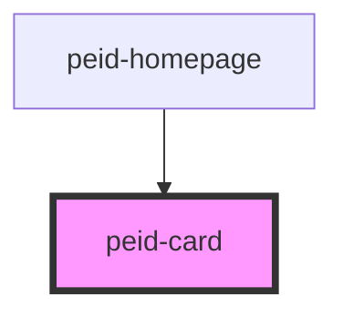

# peid-design-system

<!-- Auto Generated Below -->

## CSS Custom Properties

| Name                           | Description                            |
| ------------------------------ | -------------------------------------- |
| `--background`                 | Background of the card                 |
| `--border-bottom-left-radius`  | Bottom right border-radius of the card |
| `--border-bottom-right-radius` | Top right border-radius of the card    |
| `--border-radius`              | Border radius of the card              |
| `--border-style`               | Border style of the card               |
| `--border-top-left-radius`     | Top left border-radius of the card     |
| `--border-top-right-radius`    | Top right border-radius of the card    |
| `--border-width`               | Border width of the card               |
| `--box-shadow`                 | Box shadow of the card                 |
| `--color`                      | Font color of the card                 |
| `--padding`                    | Internal padding of the card           |
| `--padding-bottom`             | Bottom padding of the card             |
| `--padding-horizontal`         | Left and right padding of the card     |
| `--padding-left`               | Left padding of the card               |
| `--padding-right`              | Right padding of the card              |
| `--padding-top`                | Top padding of the card                |
| `--padding-vertical`           | Top and bottom padding of the card     |

## Dependencies

### Used by

 - [peid-homepage](../../pages/homepage)

### Graph

----------------------------------------------

*Built with [StencilJS](https://stenciljs.com/)*
