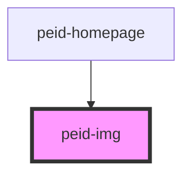

# peid-card

<!-- Auto Generated Below -->

## Properties

| Property       | Attribute       | Description                                        | Type     | Default     |
| -------------- | --------------- | -------------------------------------------------- | -------- | ----------- |
| `alt`          | `alt`           | The alt text to display if the image does not load | `string` | `undefined` |
| `height`       | `height`        | The physical height of the image                   | `number` | `undefined` |
| `primaryColor` | `primary-color` | The primary color of the image (hex)               | `string` | `undefined` |
| `src`          | `src`           | The URL or path to the image                       | `string` | `undefined` |
| `srcset`       | `srcset`        | A responsive srcset for this image                 | `string` | `undefined` |
| `width`        | `width`         | The physical width of the image                    | `number` | `undefined` |

## Dependencies

### Used by

 - [peid-homepage](../../pages/homepage)

### Graph

----------------------------------------------

*Built with [StencilJS](https://stenciljs.com/)*
