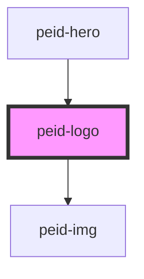

# peid-logo

## TODO

Update logo to be fetched using `getAssetPath` once it works with pre-rendering.

<!-- Auto Generated Below -->

## Dependencies

### Used by

 - [peid-hero](../hero)

### Depends on

- [peid-img](../img)

### Graph

----------------------------------------------

*Built with [StencilJS](https://stenciljs.com/)*
