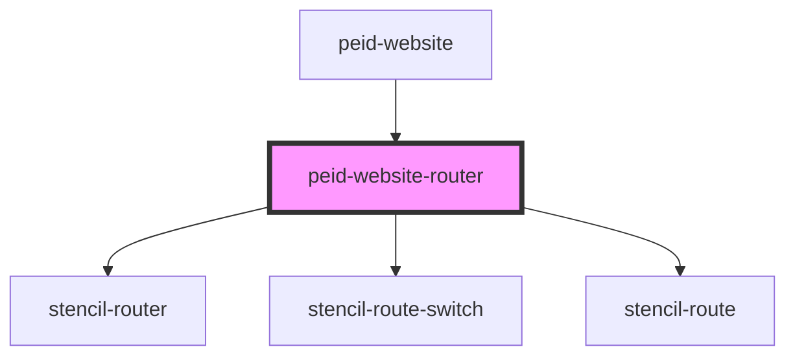

# peid-website-router

<!-- Auto Generated Below -->

## Properties

| Property    | Attribute | Description | Type                | Default     |
| ----------- | --------- | ----------- | ------------------- | ----------- |
| `postIndex` | --        |             | `string[]`          | `undefined` |
| `posts`     | --        |             | `Map<string, Post>` | `undefined` |

## Dependencies

### Used by

 - [peid-website](../..)

### Depends on

- stencil-router
- stencil-route-switch
- stencil-route

### Graph

----------------------------------------------

*Built with [StencilJS](https://stenciljs.com/)*
