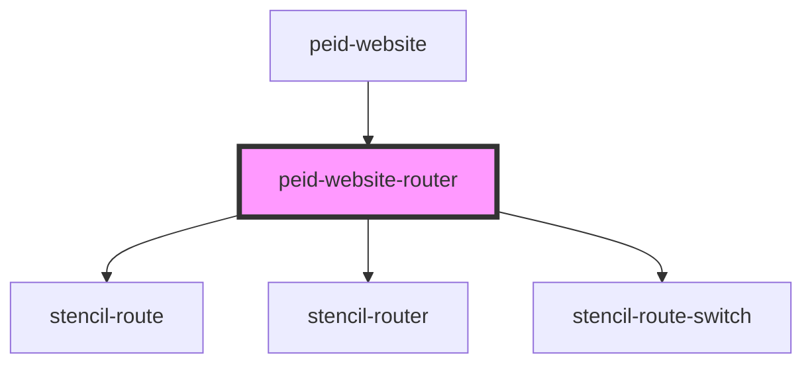

# peid-website-router

<!-- Auto Generated Below -->

## Properties

| Property | Attribute | Description | Type     | Default     |
| -------- | --------- | ----------- | -------- | ----------- |
| `posts`  | --        |             | `Post[]` | `undefined` |

## Dependencies

### Used by

 - [peid-website](../..)

### Depends on

- stencil-route
- stencil-router
- stencil-route-switch

### Graph

----------------------------------------------

*Built with [StencilJS](https://stenciljs.com/)*
