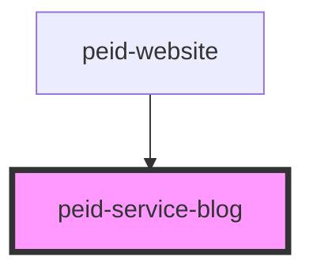

# peid-blog-service

<!-- Auto Generated Below -->

## Properties

| Property   | Attribute | Description | Type               | Default     |
| ---------- | --------- | ----------- | ------------------ | ----------- |
| `history`  | --        |             | `RouterHistory`    | `undefined` |
| `location` | --        |             | `LocationSegments` | `undefined` |

## Methods

### `getData(url: string) => Promise<any>`

#### Returns

Type: `Promise<any>`

## Dependencies

### Used by

 - [peid-website](../..)

### Graph

----------------------------------------------

*Built with [StencilJS](https://stenciljs.com/)*
