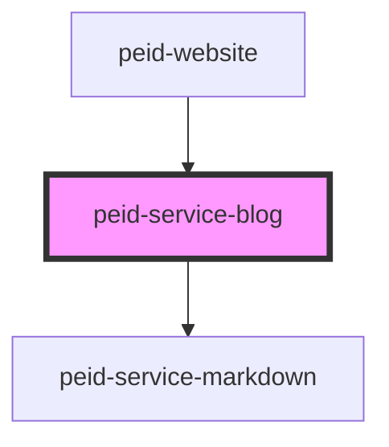

# peid-blog-service

<!-- Auto Generated Below -->

## Methods

### `getData() => Promise<({ slug: string; pageTitle: string; description: string; body?: undefined; } | { slug: string; pageTitle: string; body: string; description?: undefined; })[]>`

#### Returns

Type: `Promise<({ slug: string; pageTitle: string; description: string; body?: undefined; } | { slug: string; pageTitle: string; body: string; description?: undefined; })[]>`

## Dependencies

### Used by

 - [peid-website](../..)

### Depends on

- [peid-service-markdown](../markdown)

### Graph

----------------------------------------------

*Built with [StencilJS](https://stenciljs.com/)*
